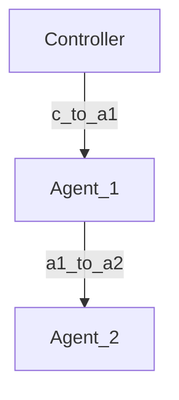

# EasyMesh-Topology-Simulation-and-Packet-Parser-Based-on-Linux-Network-Namespaces
基於 Linux Network Namespace、veth pair、Linux Bridge 與 AF_PACKET Raw Socket 的 EasyMesh/IEEE 1905.1 封包模擬與解析平台。

## 目標

本專案已完成以下能力：

- 使用 C 實作 IEEE 1905.1 / EasyMesh CMDU 與 TLV 的編碼、解析與封包處理
- 使用 Linux Raw Socket（AF_PACKET）收送 EtherType 0x893A 的 Layer 2 Ethernet 封包
- 以 Network Namespace、veth pair、Linux Bridge 建立可重現的三節點 Mesh 測試拓撲
- 實作 Controller 與 Agent 的 Discovery、Topology、Link Metric 交換流程
- 提供可自動部署的 Shell Script，支援建立、啟動、停止、截包與清除
- 支援以程式設定 RSSI 值，模擬 Link Metric 的變化
- 以模組化設計分離 Raw Socket、Ethernet、CMDU、TLV、Application Layer，便於後續擴充

## 拓撲架構

三節點鏈狀拓撲如下：

- Controller: 02:00:00:00:00:01
- Agent_1: 02:00:00:00:00:02
- Agent_2: 02:00:00:00:00:03



## 建置

```bash
make
```

產物：

- bin/easymesh-controller
- bin/easymesh-agent

## 一鍵部署與驗證

在支援 `ip netns`、`ip link`、`tcpdump` 的 Linux 主機上，執行：

```bash
sudo ./setup_mesh_env.sh all
```

常用命令：

```bash
sudo ./setup_mesh_env.sh setup
sudo ./setup_mesh_env.sh start
sudo ./setup_mesh_env.sh status
sudo ./setup_mesh_env.sh capture
sudo ./setup_mesh_env.sh stop
sudo ./setup_mesh_env.sh clean
```

## 詳細使用教學

### 1. 建置二進位檔

```bash
make
```

這會產生：

- `bin/easymesh-controller`
- `bin/easymesh-agent`

### 2. 建立網路命名空間與 veth / bridge 拓撲

```bash
sudo ./setup_mesh_env.sh setup
```

這一步會建立：

- 3 個 Network Namespace：Controller、Agent_1、Agent_2
- 2 條 veth pair：controller ↔ agent1、agent1 ↔ agent2
- 1 個 Linux Bridge：Agent_1 內的 `br-agent1`
- 對應的 MAC 位址配置

### 3. 啟動 Controller 與兩個 Agent

```bash
sudo ./setup_mesh_env.sh start
```

啟動後，三個節點會各自發送以下訊息：

- `Topology Discovery`
- `Topology Query`
- `Topology Notification`
- `Link Metric Query`

其中，多個 Agent 的拓撲通知流程如下：

1. Agent_1 與 Agent_2 會各自送出 `Topology Notification`，內容包含自己的 AL MAC、角色與鄰居列表。
2. Controller 會接收到這些通知，並回覆 `Topology Response`。
3. 在 `logs/agent1.log`、`logs/agent2.log`、`logs/controller.log` 中可以觀察到這個交換流程。

### 4. 查看執行日誌

```bash
tail -f logs/controller.log
 tail -f logs/agent1.log
 tail -f logs/agent2.log
```

### 5. 擷取 IEEE 1905.1 封包

```bash
sudo ./setup_mesh_env.sh capture
```

擷取檔會存到 `captures/`，可在 Wireshark 中開啟，使用過濾條件：

```text
eth.type == 0x893a
```

### 6. 清理環境

```bash
sudo ./setup_mesh_env.sh clean
```

## RSSI 模擬

Agent 可透過環境變數或參數設定 RSSI：

```bash
EASYMESH_RSSI=-60 ./bin/easymesh-agent agent1 --once
./bin/easymesh-agent agent2 --rssi -70 --once
```

## 自動驗證

已加入自動自測：

```bash
gcc -std=c11 -D_DEFAULT_SOURCE -Wall -Wextra -O2 -Iinclude tests/mesh_selftest.c src/app.o src/cmdu.o src/ethernet.o src/raw_socket.o src/tlv.o -o tests/mesh_selftest
./tests/mesh_selftest
```

驗證結果（已實際執行）：

- CMDU/TLV/Ethernet round trip OK

## 模組說明

- src/raw_socket.c: Linux AF_PACKET Raw Socket 開啟、發送、接收
- src/ethernet.c: Ethernet frame 編碼/解碼
- src/cmdu.c: CMDU 編碼/解碼與訊息輸出
- src/tlv.c: TLV 建構與解析
- src/app.c: Controller/Agent 的應用層流程
- apps/controller.c: Controller 入口
- apps/agent.c: Agent 入口

## 已實作流程

- Topology Discovery
- Topology Query / Topology Response
- Link Metric Query / Link Metric Response
- 基於 RSSI 模擬的 Link Metric 回報
