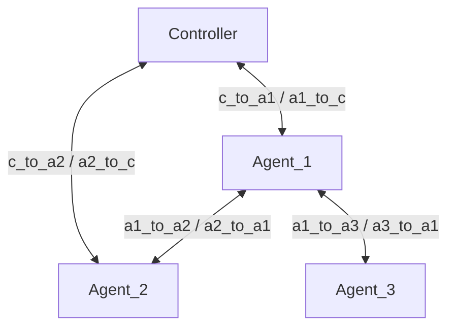

# EasyMesh-Topology-Simulation-and-Packet-Parser-Based-on-Linux-Network-Namespaces
基於 Linux Network Namespace、veth pair、Linux Bridge 與 AF_PACKET Raw Socket 的 EasyMesh/IEEE 1905.1 封包模擬與解析平台。

## 目標

本專案已完成以下能力：

- 使用 C 實作 IEEE 1905.1 / EasyMesh CMDU 與 TLV 的編碼、解析與封包處理
- 使用 Linux Raw Socket（AF_PACKET）收送 EtherType 0x893A 的 Layer 2 Ethernet 封包
- 以 Network Namespace、veth pair 建立可重現的四節點 Mesh 測試拓撲
- 實作 Controller 與 Agent 的 Discovery、Topology、Link Metric 交換流程
- CMDU 使用 IEEE 1905.1 header 格式（Version、Message Type、Message ID、Fragment、Flags），可由 Wireshark 正確辨識訊息類型
- Link Metric Query 與 Response 使用 IEEE 1905.1 的 Link Metric Query TLV（all-neighbors 為 2-byte query value）與完整 Receiver Link Metric TLV（12-byte AL header + 23-byte interface-pair metric），避免 Wireshark 顯示 malformed 或 EOM 後的額外資料警告
- 提供可自動部署的 Shell Script，支援建立、啟動、停止、截包與清除
- 支援以程式設定 RSSI 值，模擬 Link Metric 的變化
- 以模組化設計分離 Raw Socket、Ethernet、CMDU、TLV、Application Layer，便於後續擴充

## 拓撲架構

四節點拓撲採用四條指定的直接 veth link：Controller ↔ Agent_1、Controller ↔ Agent_2、Agent_1 ↔ Agent_2、Agent_1 ↔ Agent_3。Agent_1 以 `br-agent1` bridge 連接它的三個實體 veth ports，會將 IEEE 1905.1 multicast control packet 轉傳到下游 link。

- Controller: 02:00:00:00:00:01
- Agent_1: 02:00:00:00:00:02
- Agent_2: 02:00:00:00:00:03
- Agent_3: 02:00:00:00:00:04



## 建置

```bash
make
```

產物：

- bin/easymesh-controller
- bin/easymesh-agent

## 一鍵部署與驗證

在支援 `ip netns`、`ip link`、`tcpdump` 的 Linux 主機上，執行：

```bash
sudo ./setup_mesh_env.sh all
```

常用命令：

```bash
sudo ./setup_mesh_env.sh setup
sudo ./setup_mesh_env.sh start
sudo ./setup_mesh_env.sh status
sudo ./setup_mesh_env.sh capture
sudo ./setup_mesh_env.sh stop
sudo ./setup_mesh_env.sh clean
```

## 詳細使用教學

### 1. 建置二進位檔

```bash
make
```

這會產生：

- `bin/easymesh-controller`
- `bin/easymesh-agent`

### 2. 建立網路命名空間與 veth / bridge 拓撲

```bash
sudo ./setup_mesh_env.sh setup
```

這一步會建立：

- 4 個 Network Namespace：Controller、Agent_1、Agent_2、Agent_3
- 4 條 veth pair：controller ↔ agent1、controller ↔ agent2、agent1 ↔ agent2、agent1 ↔ agent3
- Agent_1 以 `br-agent1` bridge 加入 `a1_to_c`、`a1_to_a2`、`a1_to_a3`，並啟用 IEEE 1905.1 multicast MAC `01:80:c2:00:00:13` 的 bridge forwarding
- 對應的 MAC 位址配置

### 3. 啟動 Controller 與三個 Agent

```bash
sudo ./setup_mesh_env.sh start
```

啟動後，四個節點會各自進行 Topology Discovery、Topology Query 與 Topology Notification；Controller 會每 15 秒以 IEEE 1905.1 multicast 發送 Link Metric Query。Agent_1 的 Linux bridge 會將從 Controller 收到的 Query 轉傳至 `a1_to_a3`，因此無直接 Controller link 的 Agent_3 也能收到並立即回覆。

- `Topology Discovery`
- `Topology Query`
- `Topology Notification`
Agent_1 的鄰居清單會包含 Controller、Agent_2、Agent_3；Agent_3 的鄰居則只有 Agent_1。可在 `logs/agent1.log`、`logs/agent2.log`、`logs/agent3.log`、`logs/controller.log` 觀察交換流程。

### 4. 查看執行日誌

```bash
tail -f logs/controller.log
 tail -f logs/agent1.log
 tail -f logs/agent2.log
 tail -f logs/agent3.log
```

### 5. 擷取 IEEE 1905.1 封包

```bash
sudo ./setup_mesh_env.sh capture
```

擷取檔會存到 `captures/`，可在 Wireshark 中開啟，使用過濾條件：

```text
eth.type == 0x893a
```

### 6. 清理環境

```bash
sudo ./setup_mesh_env.sh clean
```

## Per-link RSSI 模擬

RSSI 僅以接收端的「單一鄰居 link」為單位保存與回報；專案沒有 per-Agent、per-Controller 的共用 RSSI 設定。每個方向都有獨立檔案：

```text
runtime/rssi/controller-from-agent1.rssi
runtime/rssi/controller-from-agent2.rssi
runtime/rssi/agent1-from-controller.rssi
runtime/rssi/agent1-from-agent2.rssi
runtime/rssi/agent2-from-controller.rssi
runtime/rssi/agent2-from-agent1.rssi
runtime/rssi/agent1-from-agent3.rssi
runtime/rssi/agent3-from-agent1.rssi
```

`sudo ./setup_mesh_env.sh setup` 會建立上述檔案並填入預設值，`start` 會自動把每個檔案傳給對應節點。Controller 啟動時先送出一次 `Link Metric Query`，之後每 15 秒送一次；Agent 收到 Query 時會重新讀取自己的 per-link RSSI 檔案，並立刻回覆 `Link Metric Response`。Controller 只在首次收到或 RSSI 值改變時輸出一行，例如：

```text
[Mesh status] Agent_1 RX from Controller: RSSI -60 dBm (updated)
[Mesh status] Agent_1 RX from Agent_2: RSSI -55 dBm (updated)
```

以下只更新 Agent_1 接收自 Controller 的量測，不影響 Agent_1 接收自 Agent_2 的量測；下一次 Controller 輪詢（最長約 15 秒）就會取得新值：

```bash
sudo sh -c 'printf "%s\n" -66 > runtime/rssi/agent1-from-controller.rssi'
```

手動啟動時，單條 link 可以用 `--rssi-link` 或 `--rssi-link-file` 指定：

```bash
sudo ip netns exec Agent_1 ./bin/easymesh-agent agent1 \
  --rssi-link controller -70 \
  --rssi-link agent2 -55 \
  --rssi-link agent3 -58
```

Controller 也只接受 per-link RSSI 設定：

```bash
sudo sh -c 'printf "%s\n" -62 > /tmp/controller-from-agent1.rssi'
sudo ip netns exec Controller ./bin/easymesh-controller \
  --rssi-link-file agent1 /tmp/controller-from-agent1.rssi
```

Controller 的 per-link 值同樣會被保留並顯示狀態變更；對 Agent RSSI 的收集則固定由 Controller 每 15 秒 Query 一次、Agent 立即 Response。

## 自動驗證

已加入自動自測：

```bash
gcc -std=c11 -D_DEFAULT_SOURCE -Wall -Wextra -O2 -Iinclude tests/mesh_selftest.c src/app.o src/cmdu.o src/ethernet.o src/raw_socket.o src/tlv.o -o tests/mesh_selftest
./tests/mesh_selftest
```

驗證結果（已實際執行）：

- CMDU/TLV/Ethernet round trip OK

## 模組說明

- src/raw_socket.c: Linux AF_PACKET Raw Socket 開啟、發送、接收
- src/ethernet.c: Ethernet frame 編碼/解碼
- src/cmdu.c: CMDU 編碼/解碼與訊息輸出
- src/tlv.c: TLV 建構與解析
- src/app.c: Controller/Agent 的應用層流程
- apps/controller.c: Controller 入口
- apps/agent.c: Agent 入口

## 已實作流程

- Topology Discovery
- Topology Query / Topology Response
- Link Metric Query / Link Metric Response
- 基於 RSSI 模擬的 Link Metric 回報
